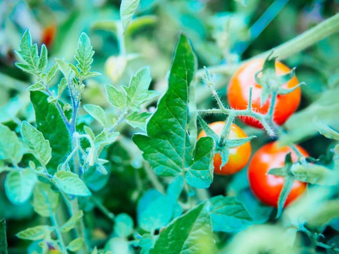
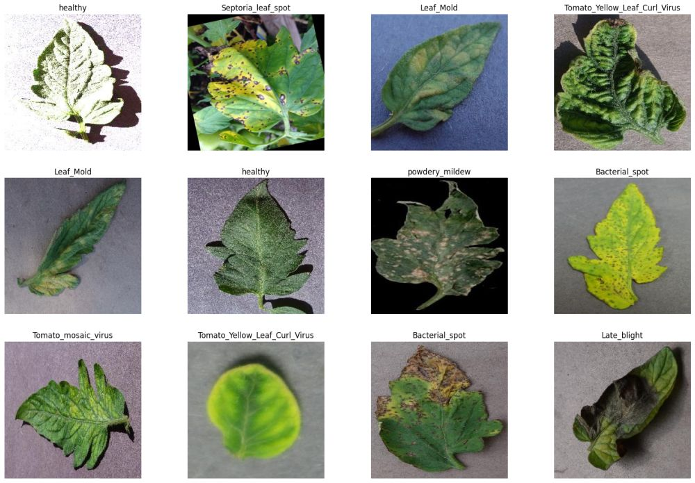
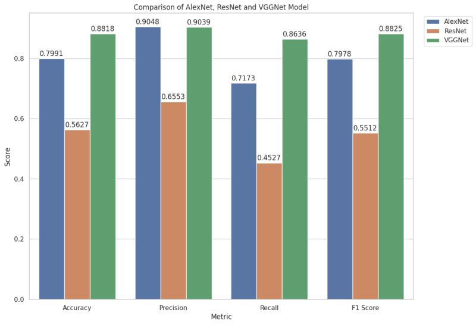
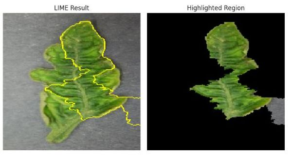
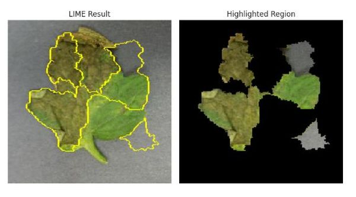

<h1 align="center">Tomato Disease Detection using Convolutional Neural Networks and Explainable AI (XAI)</h1>

<h4 align="center">Integrating Local Interpretable Model-agnostic Explanations (LIME) with CNN-based classifiers for an explainable detection of tomato diseases</h4>

 

Credit: <a href="gardenbetty.com">gardenbetty.com</a>

<h2>Table of Contents</h2>

- [Overview](#overview)
- [Dataset](#dataset)
- [Model](#model)
- [Result](#result)
- [References](#references)

<h2>Overview</h2>

Tomato is a widely cultivated and highly nutritious fruit that is consumed worldwide. However, tomato plants are susceptible to various diseases that can significantly impact their growth and yield. These diseases include bacterial spot, early blight, late blight, and many others. Although CNNs have shown impressive performance across different computer vision tasks such as plant disease detection, their interpretability is often lacking, which presents a notable limitation, especially in crucial sectors like agriculture.  
In this project, my goal is to develop a tomato disease detection system that combines a CNN-based classifier with an explainable AI (XAI) technique to provide interpretable predictions. The use of XAI allows us to provide transparency in the decision-making process of the model. This transparency helps users comprehend why certain decisions were made by the model, enhancing trust and facilitating the identification of potential biases or errors.

<h2>Dataset</h2>

The dataset used for this project was obtained from <a href="https://www.kaggle.com/datasets/oyebamijimicheal/tomato-dataset">Kaggle</a>, a platform for open-source datasets. The dataset comprises over 30,000 images of tomato leaves, which are categorized into 10 disease classes and 1 healthy class.

Data Source: <a href="https://www.kaggle.com/datasets/oyebamijimicheal/tomato-dataset">https://www.kaggle.com/datasets/oyebamijimicheal/tomato-dataset</a>

The disease class are listed below

- Late Blight
- Early Blight
- Bacterial Spot
- Septoria Leaf Spot
- Yellow Leaf Curl Virus
- Target Spot
- Tomato Mosaic Virus
- Leaf Mold
- Powdery Mildew
- Spider Mites

<h2>Model</h2>

I trained three CNN-based classifiers: VGG16, AlexNet, and ResNet-50 on the tomato disease dataset. After training and evaluating the CNN models, I focused on selecting the best-performed model based on accuracy, precision, recall and f1-score. Finally, I employed LIME (Local Interpretable Model agnostic Explanations) to further interpret the results generated by the chosen model. The overall goal of LIME is to facilitate the interpretation of the model's predictions by providing local explanations for individual predictions, thereby enhancing the transparency and explainability of our CNN based disease detection system.

<h2>Result</h2>

From the above barplot, it can be observed that VGGNet achieves the highest overall accuracy of 88.18%, indicating its ability to correctly classify instances from the dataset. VGGNet also demonstrates a good balance between precision (90.39%) and recall (86.36%), with an F1 score of 88.25%, suggesting robust performance across both positive and negative classes. Given its superior accuracy and balanced precision-recall metrics, VGGNet emerges as the preferred model. 

Included below are some of the LIME explanations for the VGGNet model. The heatmaps help users understand the model's predictions by providing insights into the model's decision-making process by highlighting the most important regions of the input image that influenced the prediction.

 

<h2>References</h2>

- Alzubaidi, L., Zhang, J., Humaidi, A. J., Al-Dujaili, A. Q., Duan, Y., Al-Shamma, O., Santamaría, J., Fadhel, M. A., Al-Amidie, M., & Farhan, L. (2021). Review of deep learning: concepts, CNN architectures, challenges, applications, future directions. Journal of Big Data, 8(1). <a href="https://doi.org/10.1186/s40537-021-00444-8">https://doi.org/10.1186/s40537-021-00444-8</a>

- Minh, D. L., Wang, H. X., Li, Y. F., & Nguyen, T. N. (2021). Explainable artificial intelligence: a comprehensive review. Artificial Intelligence Review, 55(5), 3503--3568. <a href="https://doi.org/10.1007/s10462-021-10088-y">https://doi.org/10.1007/s10462-021-10088-y</a>

- Gehlot, M., Saxena, R.K. & Gandhi, G.C. “Tomato-Village”: a dataset for end-to-end tomato disease detection in a real-world environment. Multimedia Systems 29, 3305–3328 (2023). <a hef="https://doi.org/10.1007/s00530-023-01158-y">https://doi.org/10.1007/s00530-023-01158-y</a>